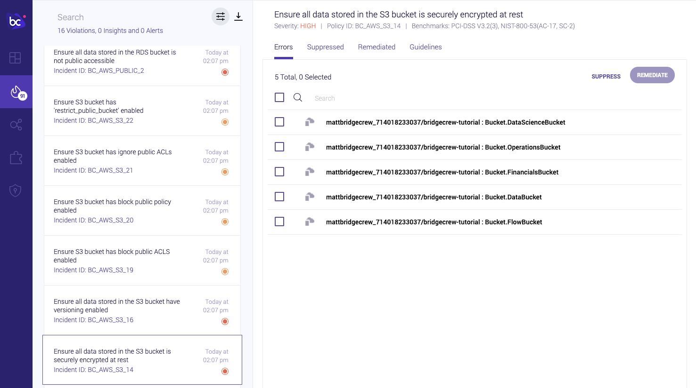
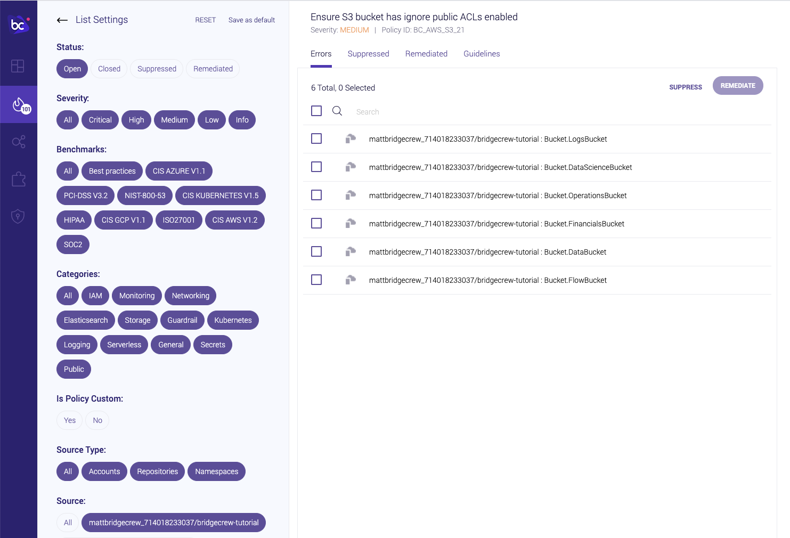
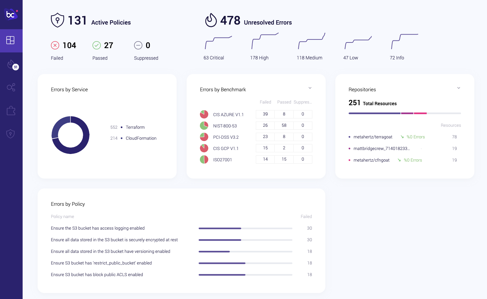

## Viewing our Pipeline results and Security Posture.
Our new CodePipeline will immediatley start running our CodeBuild job against the latest commit in our GFNGoat Repository.

You will be taken to the Pipeline Jobs page, where you will see the progress as CodeBuild *checks out* the latest commit from Github, then starts our job to run Bridgecrew against the CloudFormation.

If everything goes well, the pipeline should fail at the build stage. This is normal as the CFNGoat code is purposely designed with security flaws. Once the issues are fixed, the pipeline status should turn to green.

This allows us to prevent vulnerable infrastructure making it to any AWS account, be it test or prod, preventing security issues for your team and organisation before they happen, and helping to satisfy the requirements of the [AWS Shared Responsability Model](https://aws.amazon.com/compliance/shared-responsibility-model/)

Below we see the Pipeline sucessfully created and starting to run:

Our buld will fail, blocking the vulnerable infrastructure code from making it to any "Deploy" steps we configure in CodePipeline.

Under Build > Failed > Just Now, click **details**

Here we are provided a link to our build logs, revealing the security violations and why Bridgecrew blocked the build. **Now we don't need to manually run the bridgecrew CLI, our developers get a bridgecrew scan every time they commit!**

## Data is good, easy to visualize data is better.
While the output above is very useful, you may want to visualise issues over time with a given repository, or group objects affected by the same issue into one group for clearer understanding.

You also may not want developers having direct access to the AWS account, so viewing these of these logs could be constrained.

For all of these reasons and more, the pipeline automatically sends results to your Bridgecrew dashboard, where the issues can be correlated and visualized over time. This also allows you to provide security posture visibility to other people in the team or wider organisation (such as an enterprise security team), without needing to manage further IAM access to the AWS accounts.

### Investigating security violations in Bridgecrew

You will notice, our *AWS Code Build* integration has gone green in the Bridgecrew Dashboard, and we've received data. You can see the AWS account ID and the name of our CodeBuild pipeline, received from our CodeBuild job!

Clicking into Incidents, you'll see a all of the issues, the same ones reported in the CodeBuild logs, but with resources grouped by issue and a lot more information and context, such as severity and Guidelines on the underlying security issue!

You can also filter to just the issues reported from your CodeBuild pipeline by pipeline and account name, if you already have numerous data sources integrated:

Clicking on a specific resource provides code insights and the resource details, We'll cover remediation and automated fixes in the next module!

Bridgecrew also provides at a glance dashboards, providing historical trends and collated information from all of your monitoring sources, such as multiple CodeBuild pipelines, AWS runtime issues and more!

## Congratulations!
You've just automated security scanning of your Infrastructure-as-Code into a developer friendly CI/CD pipeline, and exposed easy to comprehend visualisations of issues which can be easily shared with your organisation to enforce trust and security posture.

In the next module, we'll look at howto fix these issues, as well as providing more tips for integrating security into the developer workflow, without causing friction.