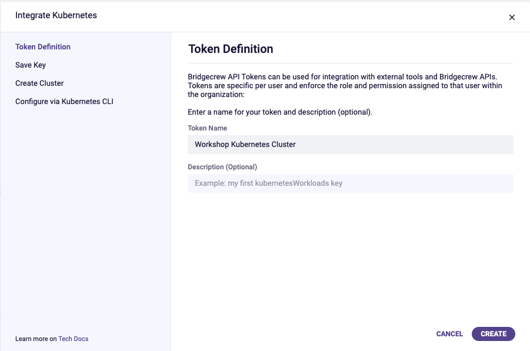
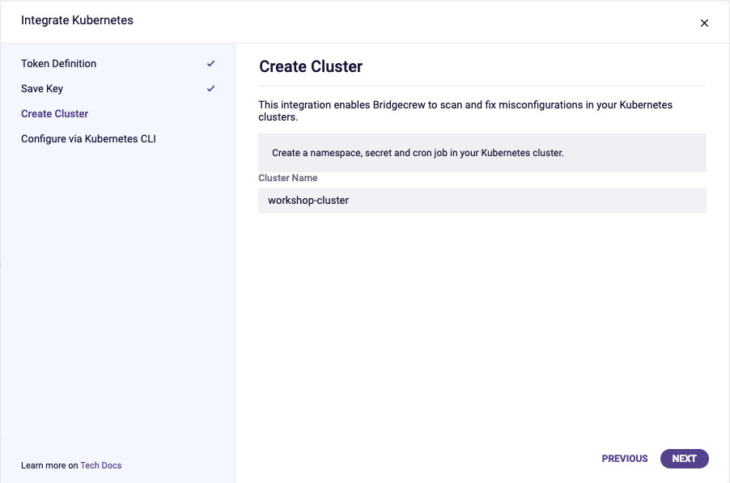
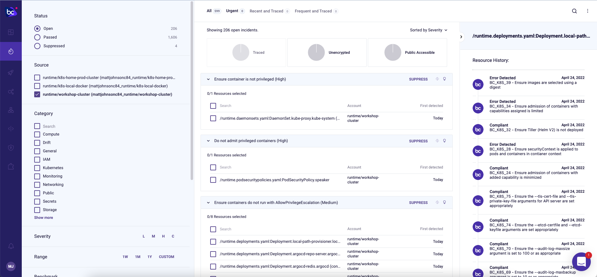

## Kubernetes Runtime

Great! Now lets add insight into our already-running Kubernetes workloads too!  
In the integrations page, once again click *“ADD INTEGRATION”*

Then, from the *Cloud Providers* section, chose *Kubernetes*:

Create a new API key for the integration and click “*CREATE”*:

Give the *cluster a name*, this is used to identify the Kubernetes cluster within Bridgecrew.

Finally, select your kubernetes version (>0.19 or &lt;0.19) and *copy the provided kubectl commands:*

Next, we simply *run the Kubectl commands* provided to enable the runtime integration in our Kubenetes cluster: 

By running `kubectl get cronjob –namespace bridgecrew’ we can see the bridgecrew runtime agent, scheduled to run and keep bridgecrew updated with the runtime posture of the cluster.

Instead of waiting for the first scheduled run, lets manually run the job the first time so we can see data in the Bridgecrew dashboard: 

`kubectl create job --from-cronjob/bridgecrew manual-bc-runtime-scan --namespace=bridgecrew`

_We will now start to see data under the incidents tab in the Bridgecrew dashboard, you can check on the status of the Job’s instance with the `kubectl get job` command also.

In the *Incidents* tab, which covers *only* runtime-related events, we will be able to filter on our new cluster name, to see issues with the current running pods and services.

Some of these are core kubernetes services which require more access than regular hosted applications, so we’ll be looking at how to suppress and create suppression rules for certain items, as well as fixing up our buggy dev environment code in future workshops!

### Congratulations, Runtime scanning is enabled!
