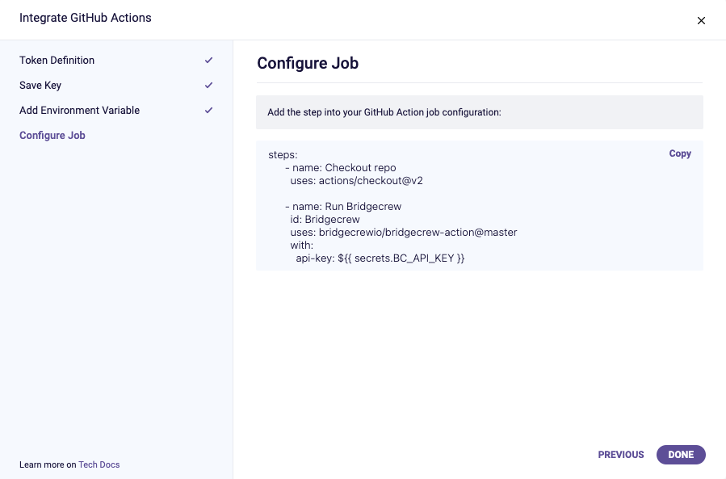
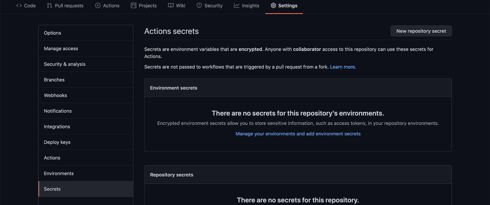
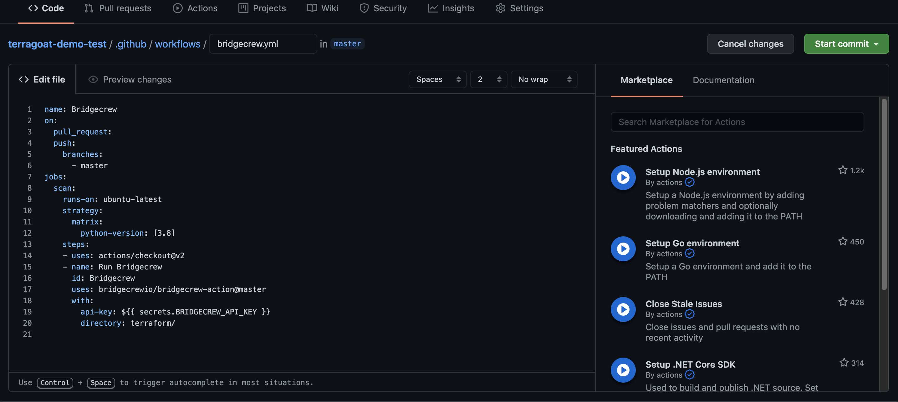
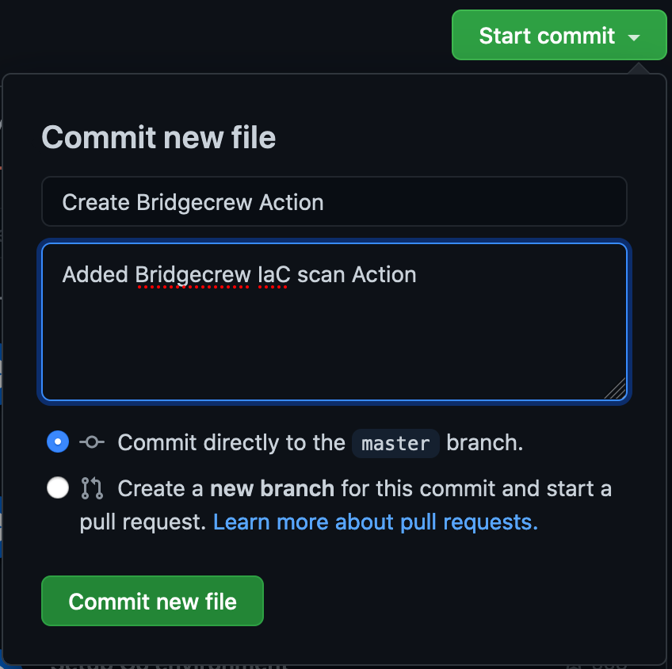
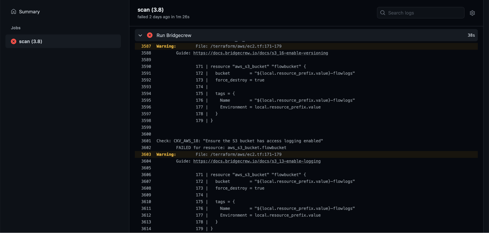

## Setting up the Bridgecrew GitHub Action

You can leverage GitHub actions to run automated scans for every build or specific builds, such as the ones that merge into the master branch. This action can alert on misconfigurations or you can set it up to block code from being merged if certain policies are violated. It can also send the results to Bridgecrew for further review and remediation steps.

{}
<p style='text-align: left;'>
The TerraGoat repository already has a Checkov Action built in at terragoat/.github/workflows/pull\_request.yaml and terragoat/.github/workflows/checkov.yaml. You can remove those files to remove that redundant scan, but we will keep it for this workshop.

Typically, you wouldn’t do more than one scan during a build, such as two Actions, a CI/CD integration and a Terraform Cloud scan, so you can remove the Actions when you setup the Terraform Cloud scan or leave it for illustrative purposes.
</p>
{}

Start with the [GitHub Actions integration page](https://www.bridgecrew.cloud/integrations/githubActions) and select “Add Subscription.”



The integration provides steps to enable GitHub actions, which you’ll walk through below.


You need to add that key to GitHub in their secrets store as an environment variable. This prevents your API key from being public when you have your code in a public repository.

Go to your fork of TerraGoat on GitHub and select “Settings”.


Then select “Secrets” from the left, and click “New Repository Secret”.



Name the secret `BRIDGECREW_API_KEY` as instructed in the Bridgecrew integration details above.

Copy and paste your API Token from the Bridgecrew integration details page into the value field.


Selecting “Add secret” will list the secret in the “Settings” -> “Secrets” page.

### Adding the automated workflow

Github Actions are defined as workflow files, within your code repository under the .github/workflows directory. To create an action, you’ll add a new file to this directory. If you already have workflows and are familiar with the workflow file format, you could add the Bridgecrew step section to your own workflows for the same results.

To create a new workflow, select “Actions” within your TerraGoat forked repository then select “New Workflow.”


Select “Set up a workflow yourself” to create a new, blank workflow.

Name the new file bridgecrew.yaml and replace the entire contents with the workflow template provided below, This takes the jobs section provided by the Bridgecrew integration instructions and wraps it in a fully functional GitHub Actions definition.

```
name: Bridgecrew
on:
  pull_request
jobs:
  scan:
    runs-on: ubuntu-latest
    strategy:
      matrix:
        python-version: [3.8]
    steps:
    - uses: actions/checkout@v2
    - name: Run Bridgecrew 
      id: Bridgecrew
      uses: bridgecrewio/bridgecrew-action@master
      with:
        api-key: ${{ secrets.BRIDGECREW_API_KEY }}
        directory: terraform/
```

Select “Start commit” once you’ve added the workflow file contents:



Finally, save the new workflow file into your code repository by selecting “Commit new file”.



The GitHub Action will start running Bridgecrew scans against the latest commit in your TerraGoat repository. You can see this by selecting the “Actions” page within your TerraGoat forked repository in GitHub. You will see a new workflow, titled Bridgecrew and the job that was kicked off by merging in the workflow yaml file.


Selecting this job will allow you to view the status and logging output from the pipeline, where checkov will run and output any violations found in the TerraGoat codebase.

Rather than digging through the job logs, the action also outputs annotations for each violation found into the “Summary” page of the action. Again, we can see the identified misconfigurations:



The Bridgecrew GitHub Action can either pass all builds or block builds based on policy violations. The first acts as just an observability and alerting tool, the second as guardrails for developers to prevent misconfigured templates from making it into the repository. You can change the `soft_fail` setting to block builds in the `bridgecrew.yaml` file.