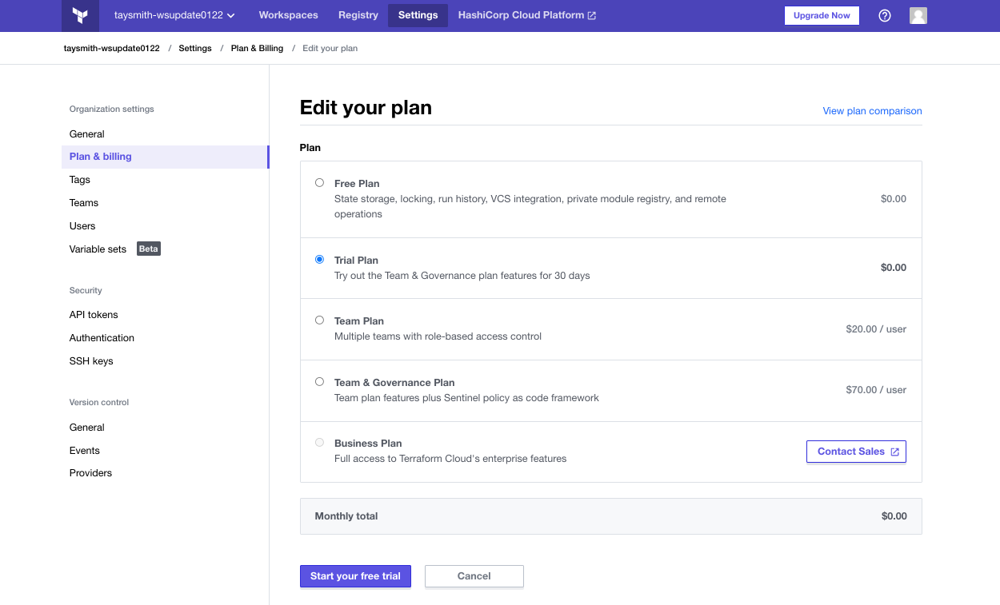
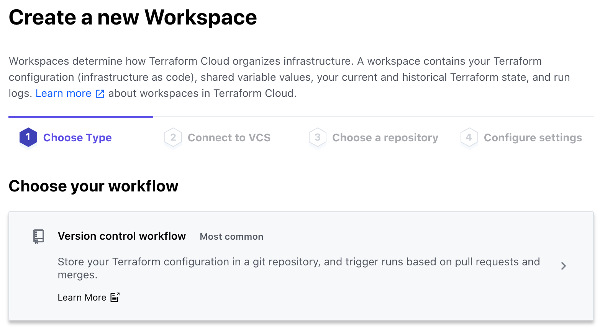
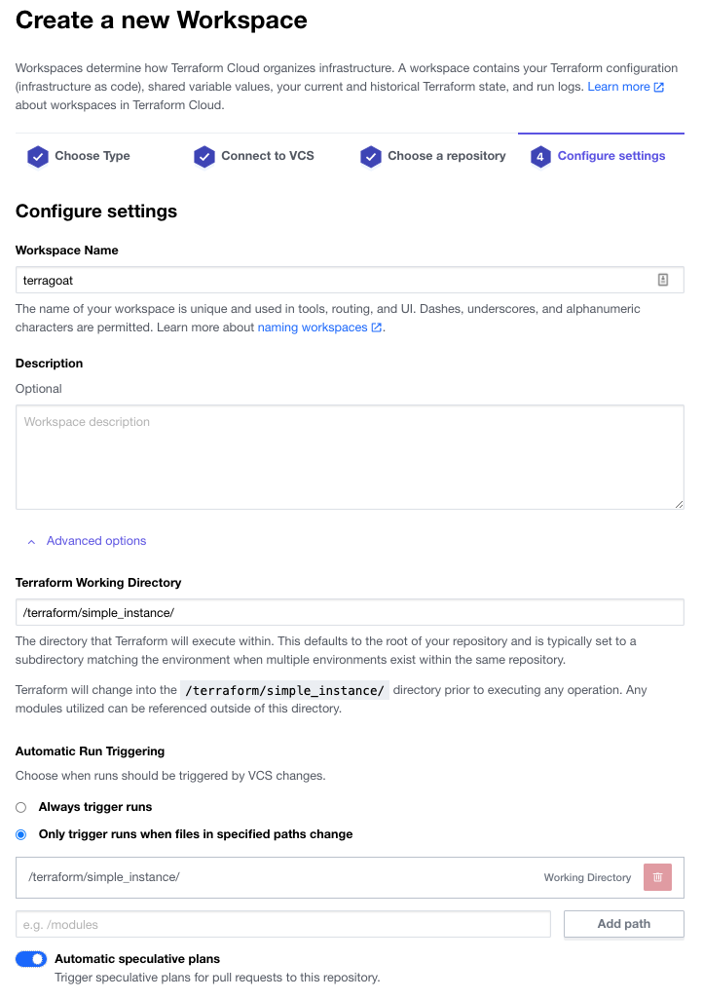
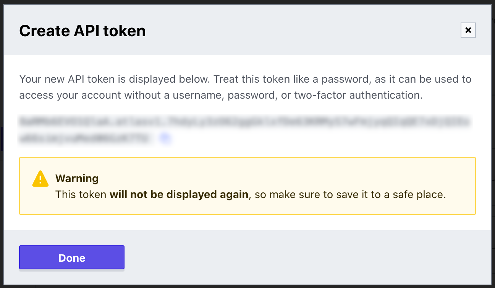
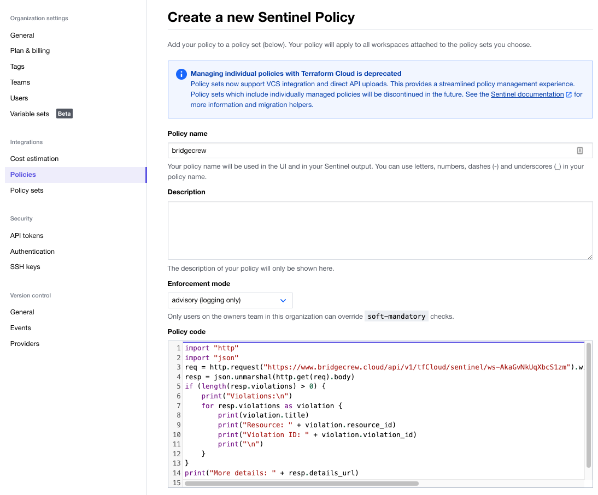

{}

A new, native integration between Bridgecrew and Terraform Cloud is coming soon! Check out the HashiCorp keynote for a preview: https://youtu.be/ZzLZaWUve4M?t=1387

{}

## Leveraging Terraform Cloud and Sentinel for Bridgecrew scans

Bridgecrew has a native integration with Terraform Cloud that leverages Sentinel for policy controls. This means any commit that is pushed to Terraform Cloud will run through a Bridgecrew scan, identifying policy violations, blocking misconfigured builds and detecting drift, all from the same place that you collaborate on Terraform templates, automate deployments, and store state.

{}
Sentinel is a paid add-on. If you want to try this out for free, HashiCorp does offer a free trial. If you prefer not to sign up for the trial, feel free to skip this section and the "drift detection" section.
{}

To sign up for the free trial of Terraform Cloud’s Team & Governance plan, go to your Terraform Cloud instance. Select “Settings” and “Plan & Billing.” Choose the Trial option. You should see Policies and Policy Sets show up in the left navigation menu.

You need to add your TerraGoat repository to Terraform Cloud. Go to “Workspaces” and select “Create one now.”

Select “Version control workflow”:

Select “GitHub” and choose your TerraGoat repository we previously forked:

Name the workspace `terragoat` and open the “Advanced options” and add the directory `/terraform/simple_instance/` (we'll be adding that directory later). This will focus the scans to just the aws templates. Turn on "Automatic speculative plans" to create plans for pull requests. Select “Create workspace”:

Select “Configure variables” and add your AWS Account and Access Keys as environment variables called `AWS_ACCESS_KEY_ID` and `AWS_SECRET_ACCESS_KEY`. If you aren’t sure where to find the keys, see [this guide](https://docs.aws.amazon.com/powershell/latest/userguide/pstools-appendix-sign-up.html).

Go to Settings and select General. From this settings screen, grab your workspace ID for the next step.

Grab the API token from Terraform Cloud for the integration. Go to the [API token menu](https://app.terraform.io/app/settings/tokens) (User -> Settings -> Tokens) and select “Create an API token.”

Copy that API token for the next step.

Next, you’ll add the Bridgecrew integration. Head over to the [Integrations](https://www.bridgecrew.cloud/integrations) screen in the Bridgecrew platform. Scroll down and select Terraform Cloud and Add Workspace. Fill in the Workspace ID, workspace name, and API token from the previous steps:

Selecting “Create Policy” will generate a Sentinel Policy that you can then add to Terraform Cloud.

Head back to Terraform Cloud and go to the “[Policies](https://app.terraform.io/app/bridgecrew-demo/settings/policies)" setting and "Create a new policy". Name the policy `bridgecrew` and paste the code you copied in the Bridgecrew integration page and paste it into the “Policy code” section and select “Create policy”:

Select “[Policy Sets](https://app.terraform.io/app/bridgecrew-demo/settings/policy-sets)” and “Connect a new policy set”. You can create a versioned policy set, but for the sake of this workshop, go without a VCS connection. Name your setting and choose the `terragoat` workspace and select “Connect policy set”.

Go back to the “[Policies](https://app.terraform.io/app/bridgecrew-demo/settings/policies)” section and select the policy you made. Scroll down to the “Policy Sets” section and add the `terragoat_set` you made.

Finally, go to your workspace's main page and queue a run. Don't worry if it fails, this just primes the runs to be automated with future GitHub pull requests.

**Your Terraform Cloud integration is ready to go!**