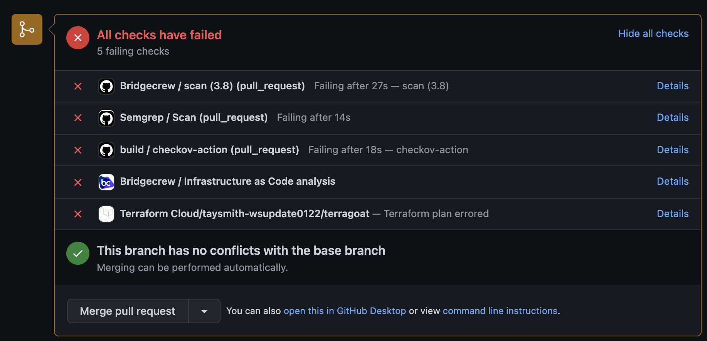

## Kick off a test pull request

Check that all three integrations are working by kicking off a pull request. Go back to your fork of the TerraGoat repo and select "Add file" -> "Create new file." Set the path to `terraform/simple_instance/ec2.tf`. Add the following code:

```
provider "aws" {
  region = "us-east-1"
}

resource "aws_security_group" "ssh_traffic" {
  name        = "ssh_traffic"
  description = "Allow SSH inbound traffic"
  ingress {
    description = "SSH"
    from_port   = 22
    to_port     = 22
    protocol    = "tcp"
    cidr_blocks = ["0.0.0.0/0"]
  }
}

resource "aws_instance" "web_server_instance" {
  ami = data.aws_ami.ubuntu.id
  instance_type = "t2.micro"
  security_groups = [ "${aws_security_group.ssh_traffic.name}" ]
  tags = {
    Name = "bc_workshop_ec2"
  }
}

data "aws_ami" "ubuntu" {
  most_recent = true

  filter {
    name = "name"
    values = ["ubuntu/images/hvm-ssd/ubuntu-bionic-18.04-amd64-server-*"]
  }

  filter {
    name   = "virtualization-type"
    values = ["hvm"]
  }

  owners = ["099720109477"] # Canonical
}
```


Select "Create a new branch" and "Propose new file." 


Then "Create a pull request." After a few seconds, you should automatically see Code Review Comments. Expand one to see the additional details like Fix recommendations. At the bottom, you should see five checks:

- The Checkov GitHub Action
- The Bridgecrew GitHub Action
- The Bridgecrew GitHub Application
- Two Terraform Cloud integration checks



You can fix the violations later, but for now, click "Merge pull request" and "Confirm merge." Head back over to Terraform Cloud and select the latest run. You'll again see the policy violations, but since we set the failure level to "advisory (logging only)," we can still apply the template.

{}
We're using a free tier instance (t2-micro), but remember to cleanup with terraform destroy at the end to avoid additional charges from AWS.
{}

Click "Confirm & Apply." This will deploy the simple EC2 instance and security group. Optionally, head over to your AWS console to confirm an instance was created.


### Congratulations!

You’ve now set up a GitHub Action, a Terraform Cloud integration, and a GitHub Application to secure your Terraform templates.

In the next module, you’ll look at how to investigate and fix the issues arising from the automated scans, as well as providing more tips for integrating security into the developer workflow without causing friction.