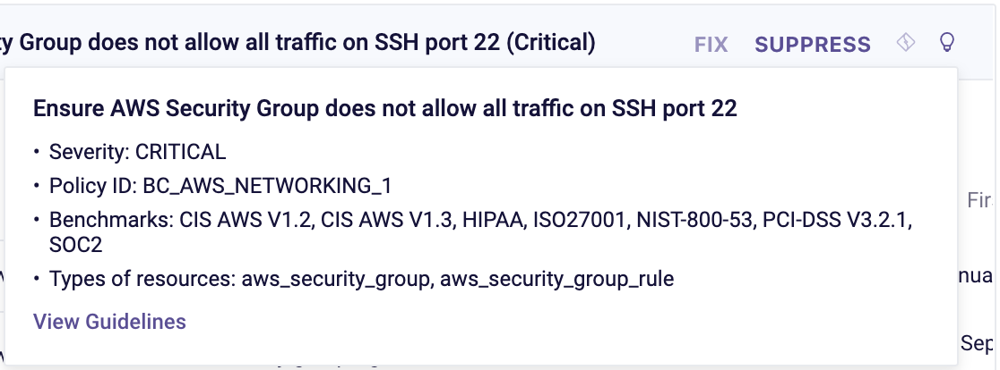

## Scanning runtime resources for vulnerable infrastructure

Let’s switch gears to address infrastructure that wasn't deployed by Terraform.

Greenfield infrastructure as code deployments are a luxury not many of us have. In reality, our AWS accounts have objects that were created manually for one reason or another. Transitioning to IaC is rarely a one-and-done affair, so you may have objects in your AWS accounts that are managed by a team that has not yet made the switch.

That’s why it’s important to scan objects directly in your AWS environment in addition to scanning your Terraform templates in git or as part of the CI/CD pipeline, as we’ve already shown.

Bridgecrew provides runtime scanning via an AWS integration, allowing full coverage of infrastructure security both before and after deployment.

### AWS runtime integration

To enable runtime scanning of your AWS account, go to the [**Integrations Tab**](https://www.bridgecrew.cloud/integrations/catalog/aws-api-access) and select "AWS" under the **Cloud Providers** section. Choose the `AWS Read Access Stack` and click "Next."

{}

Read-only access is scoped as minimally as possible in order to give Bridgecrew only the necessary access to scan your AWS accounts.

{}

Click "Launch Stack" to enable the integration.

You will be taken to your AWS account to spin up the CloudFormation stack to authorize the integration:

**Check the checkbox** to approve the IAM permission creations via our CloudFormation stack, and click **Create Stack**:

You can track the progress of the stack creation within your AWS account.

 Once completed, you'll see the integration in the Bridgecrew Integrations dashboard:

That’s all it takes to connect your AWS account to Bridgecrew for continuous cloud security monitoring and compliance benchmarking.

### Exploring runtime violations

With the AWS account connected, you'll start to see runtime violations in the [Incidents](https://www.bridgecrew.cloud/incidents) page.

{}

Unlike the rest of this workshop, the information displayed in your Bridgecrew Dashboard may differ from the images below, as no two AWS accounts will have the same content.

{}

We can browse through all the security and compliance violations detected in our live AWS account. We can filter based on Status, Source, Category, Severity, Time Range, Benchmarks, and Tags. There are "low hanging fruit" filters for traced resource, unencrypted resources and publicly accessible resources.

In the example below, we can see a security group we deployed previously that opens port 22 to all traffic:

Further context on the issue and remediation options is also available by clicking on the lightbulb and on the "Guidelines" link.

Bridgecrew also alerts on account-wide settings such as user password policies and informational best practices, such as tagging each resource with ownership or purpose information or weak account password policies:

### Identity and Access Management (IAM) Insights

Bridgecrew also analyzes AWS IAM roles, permissions, groups, and policies to identify unused and overly-permissive configurations. You can use the filter pane to only show IAM specific issues.

Next, we'll look at Drift Detection.