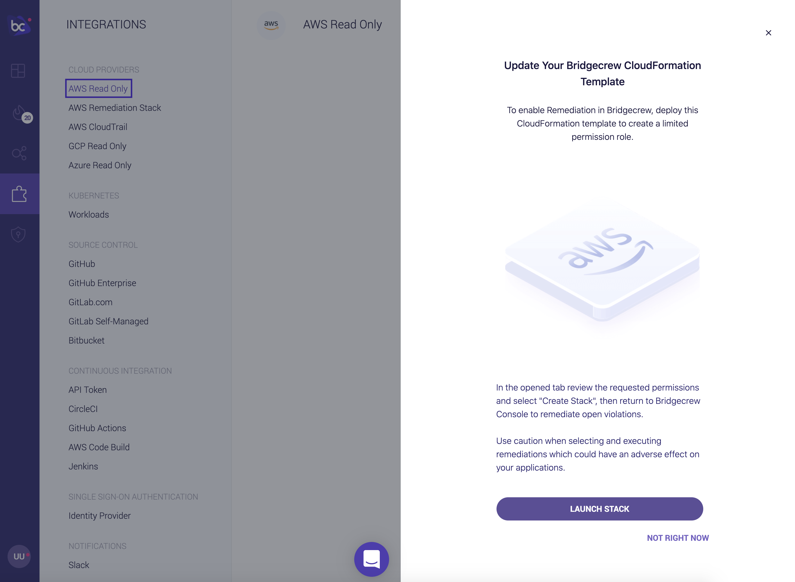
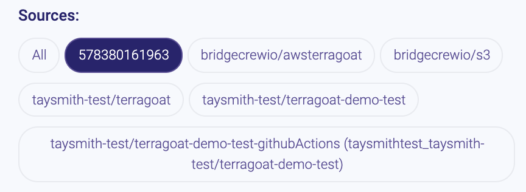
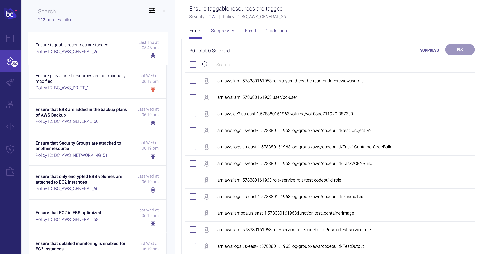
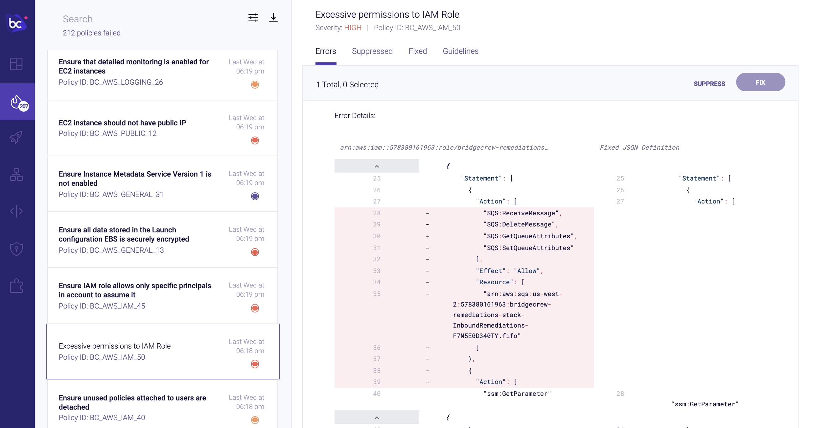

## Scanning runtime resources for vulnerable infrastructure

Let’s switch gears to address infrastructure that wasn't deployed by Terraform.

Greenfield infrastructure as code deployments are a luxury not many of us have. In reality, our AWS accounts have objects that were created manually for one reason or another. Transitioning to IaC is rarely a one-and-done affair, so you may have objects in your AWS accounts that are managed by a team that has not yet made the switch.

That’s why it’s important to scan objects directly in your AWS environment in addition to scanning your Terraform templates in git or as part of the CI/CD pipeline, as we’ve already shown.

Bridgecrew provides runtime scanning via an AWS integration, allowing full coverage of infrastructure security both before and after deployment.

### AWS runtime integration

To enable runtime scanning of your AWS account, go to the [**Integrations Tab**](https://www.bridgecrew.cloud/integrations) and select **AWS Read Only** under the **Cloud Providers** section.

{}

Read-only access is scoped as minimally as possible in order to give Bridgecrew only the necessary access to scan your AWS accounts.

{}

Click **Add Account**, then **Launch Stack** to enable the integration: 

You will be taken to your AWS account to authorize the integration:

**Check the checkbox** to approve the IAM permission creations via our Terraform stack, and click **Create Stack**:

You can track the progress of the stack creation within your AWS account. Once completed, you'll see the integration turn green in the Bridgecrew dashboard:

Successful integration: 

That’s all it takes to connect your AWS account to Bridgecrew for continuous cloud security monitoring and compliance benchmarking.

### Exploring runtime violations
With the runtime AWS account connected, let’s edit our filters on the [Incidents](https://www.bridgecrew.cloud/incidents) page to show only the AWS source. In the filters option pane, select your AWS account ID that should now show up alongside your other integrations from the earlier modules.

{}

Unlike the rest of this workshop, the information displayed in your Bridgecrew Dashboard may differ from the images below, as no two AWS accounts will have the same content.

{}

After setting our filter, we can browse through all the security and compliance violations detected in our live AWS account, 

In the example below, we can see the security group we deployed previously that opens port 22 to all traffic. Selecting a resource from the group of resources on the right-hand side will display much more information, including a Terraform representation of the AWS object in question:

Further context on the issue and remediation options is also available in the **Guidelines** tab.

Bridgecrew also alerts on account-wide settings such as user password policies and informational best practices, such as tagging each resource with ownership or purpose information:

Untagged items in account:

Weak account password policy:

### Identity and Access Management (IAM) Insights
Bridgecrew also analyzes AWS IAM roles, permissions, groups, and policies to identify unused and overly-permissive configurations.

You can use the filter pane to only show **Insights**, highlighting IAM specific issues:

IAM Insights will even provide a re-written, rightsized IAM policy document with only the permissions your applications are requesting of the role or policy. This helps you build and maintain least-privilege IAM and reduces the scope of abuse from a misconfigured or exploited application.

Next we'll create some fixes in production.