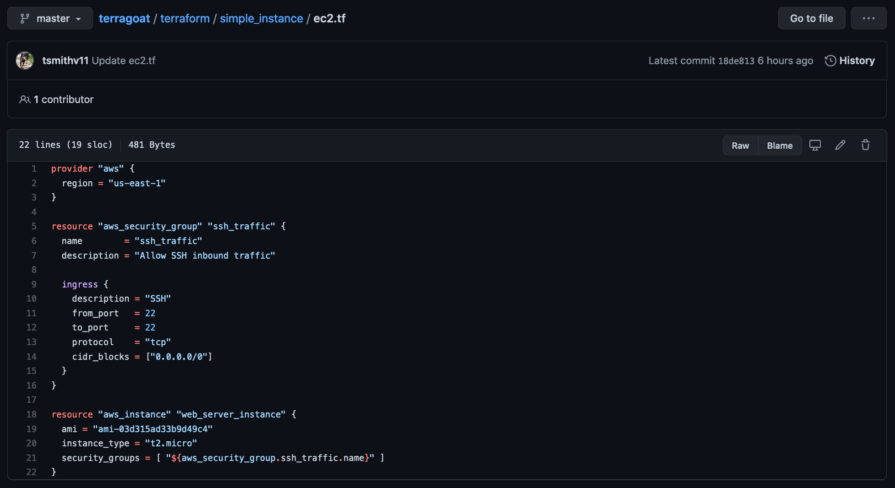
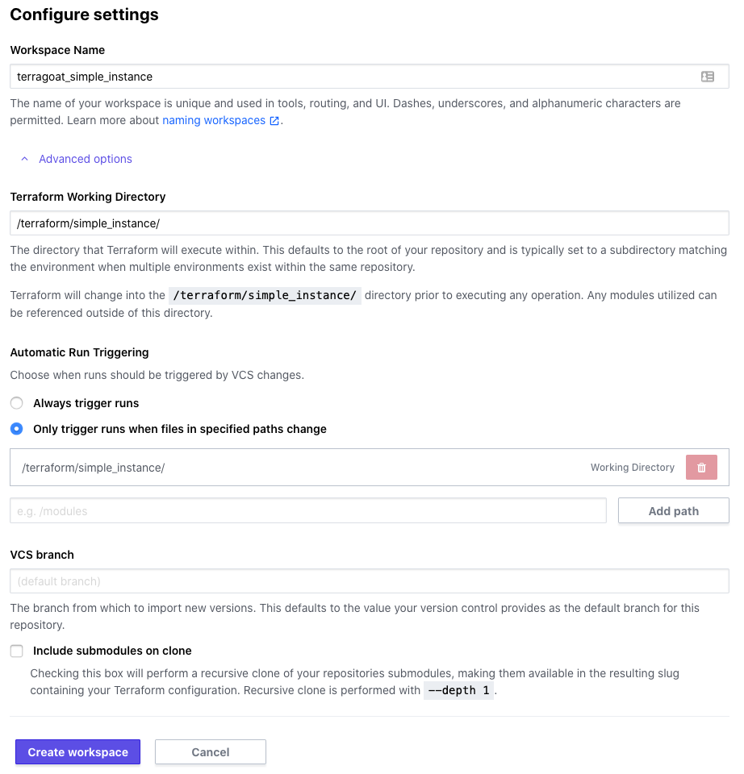
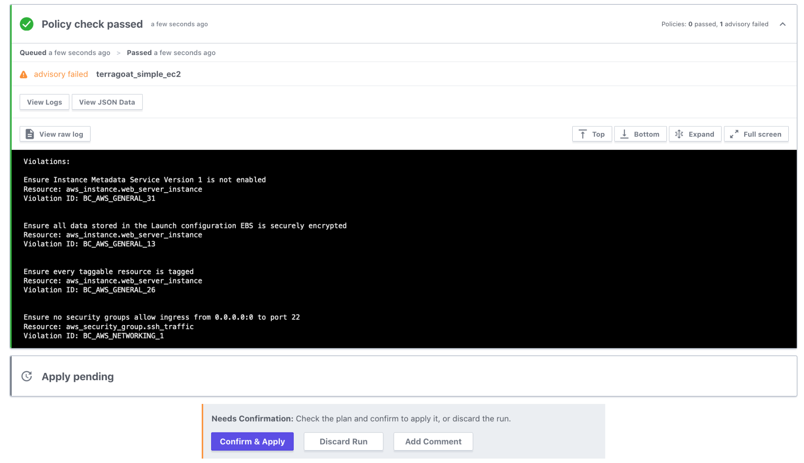

## Drift detection with Bridgecrew and Terraform Cloud

In this final section, you’ll switch gears and detect drift. Drift occurs when the infrastructure deployed in the cloud is different from what was defined in the IaC template. You call what the infrastructure should be the “state” saved in files locally or in Terraform Cloud. For example, if the infrastructure in AWS may have different configurations than the Terraform template defined.

This usually occurs during a major incident, where DevOps and SRE teams make manual changes to quickly solve the problem, such as opening up ports to larger CIDR blocks or turning off HTTPS to find the problem. If these aren’t reverted, they present security issues and it weakens the auditability benefit of IaC versioning.

### Create drift

TerraGoat is a great resource for learning about a myriad of IaC misconfigurations, but it provisions a lot of infrastructure. You’ll create a simple Terraform template to try out drift detection.

In your Terragoat repository in GitHub, create a new file `terragoat/terraform/simple_instance/ec2.tf`. In this file, add the following Terraform code to provision a simple EC2 instance:

```
provider "aws" {
  region = "us-east-1"
}

resource "aws_security_group" "ssh_traffic" {
  name        = "ssh_traffic"
  description = "Allow SSH inbound traffic"
  ingress {
    description = "SSH"
    from_port   = 22
    to_port     = 22
    protocol    = "tcp"
    cidr_blocks = ["0.0.0.0/0"]
  }
}

resource "aws_instance" "web_server_instance" {
  ami = "ami-03d315ad33b9d49c4"
  instance_type = "t2.micro"
  security_groups = [ "${aws_security_group.ssh_traffic.name}" ]
}
```



Head over to Terraform Cloud and select “Workspaces” in the top menu. Select “+ New workspace”. Select “Version control flow” -> “GitHub” -> “terragoat” repository. Name it `terragoat_simple_instance`. Open up the “Advanced options”. In the working directory, enter `/terraform/simple_instance/`. This will limit Terraform Cloud performing actions to just changes to your new file. Select “Create workspace”.



Select “Configure variables” and add your AWS credentials for `AWS_ACCESS_KEY_ID` and `AWS_SECRET_ACCESS_KEY`.


Go to “Settings” -> “General” and grab the workspace ID.


Head over to Bridgecrew and select the Integrations tab -> [Terraform Cloud](https://www.bridgecrew.cloud/integrations/terraformCloud). Select “Add Workspace”. Fill in the information from your workspace and add the Terraform Cloud API token from earlier.


Select “Create Policy” and copy the generated content for the next step.

Back in Terraform Cloud, go to “Settings” in the top navigation menu. Select “Policy Sets” -> “Connect a new policy set” -> “No VCS connection”. Provide the name `terragoat_simple_ec2_set` and select “Policies enforced on selected workspaces”. Add the `terragoat_simple_ec2` workspace and select “Connect policy set”.


Under Settings select “Policies” -> “Create a new policy”. Give it the name `terragoat_simple_ec2` and change the “Enforcement mode” to “advisory (logging only)”. Paste the policy code from Bridgecrew. Then add the `terragoat_simple_ec2_set` and select “Create policy”.


Head over to “Workspaces” and select “terragoat_simple_ec2”. Select “Queue plan”. This will show that the Policy check passed with an advisory fail. Apply it anyway. Select “Confirm & Apply”.



Head over to your AWS console and confirm that a new EC2 instance is booting up. Go to the [EC2 console](https://console.aws.amazon.com/ec2) and confirm that there is a new t2.micro instance running.


Next, add another open port to your security group to see what happens. Select the new instance you made and select the security group for that instance.


Select “Edit inbound rules” and “Add rule”. Enter a random port -- I used the default port for MongoDB, 27017, and enter the CIDR block `0.0.0.0/0`. Select “Save rules”.


Bridgecrew scans your cloud configurations periodically, but to speed up the process, you can use the following API call in your terminal with your Bridgecrew API key from the earlier steps.

```
curl -X POST -H "Authorization: $BC_API_KEY" https://www.bridgecrew.cloud/api/v1/scans/integrations
```

That will force start a scan of your environment that will find misconfigurations and identify drift from your Terraform state. After a few moments, head back over to the [Incidents](https://www.bridgecrew.cloud/incidents) section of Bridgecrew. Search for the policy “Ensure provisioned resources are not manually modified” and select the object. Here you can see the difference in AWS versus the state saved in Terraform Cloud.


You found drift! From here you can either run `terraform apply` to bring your cloud instances back inline with the state saved in Terraform Cloud or make the changes to your Terraform templates to match the changes made in production and update the state in Terraform Cloud.