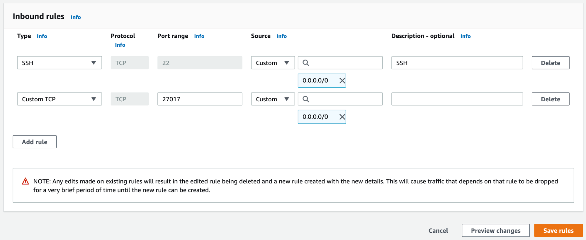
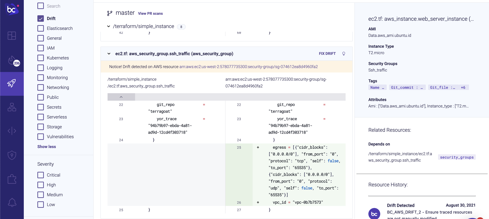

## Drift Detection between AWS and Terraform Cloud state using Bridgecrew

In this final section, you’ll switch gears and detect drift. Drift occurs when the infrastructure deployed in the cloud is different from what was defined in the IaC template. You call what the infrastructure should be the “state” saved in files locally or in Terraform Cloud. For example, if the infrastructure in AWS may have different configurations than the Terraform template defined.

This usually occurs during a major incident, where DevOps and SRE teams make manual changes to quickly solve the problem, such as opening up ports to larger CIDR blocks or turning off HTTPS to find the problem, or if there are knowledge or access control gaps that make fixing an issue in the cloud directly the easier option. If these aren’t reverted, they present security issues and it weakens the benefits of using IaC.

### Create drift

Make sure you've applied the Terraform resources from the [Test Pull Request](https://workshop.bridgecrew.io/terraform/40_module_two/2005_kickoff_pr.html) section.

Confirm in your AWS console that your new EC2 instance is booting up. Go to the [EC2 console](https://console.aws.amazon.com/ec2) and confirm that there is a new t2.micro instance running.


Next, add another open port to your security group to see what happens. Select the new instance you made and select the security group for that instance.


Select “Edit inbound rules” and “Add rule”. Enter a random port -- I used the default port for MongoDB, 27017, and enter the CIDR block `0.0.0.0/0`. Select “Save rules”.



Bridgecrew scans your cloud configurations periodically, but to speed up the process, you can use the following API call in your terminal with your Bridgecrew API key from the earlier steps.

```
curl -X POST -H "Authorization: $YOUR_BC_API_KEY" https://www.bridgecrew.cloud/api/v1/scans/integrations
```

That will force start a scan of your environment that will find misconfigurations and identify drift from your Terraform state. After a few moments, head back over to the [Incidents](https://www.bridgecrew.cloud/incidents) section of Bridgecrew. Search for the policy “Ensure provisioned resources are not manually modified” and select the object. Here you can see the difference in AWS versus the state saved in Terraform Cloud.



You found drift! From here, you can either run `terraform apply` to bring your cloud instances back in line with the state saved locally or in Terraform Cloud, or make the changes to your Terraform templates to match the changes made in production and update the state in Terraform Cloud. Alternatively, in the Projects page, you will find **Fix Drift** that will open a pull request on your behalf to make the change to match code to cloud.